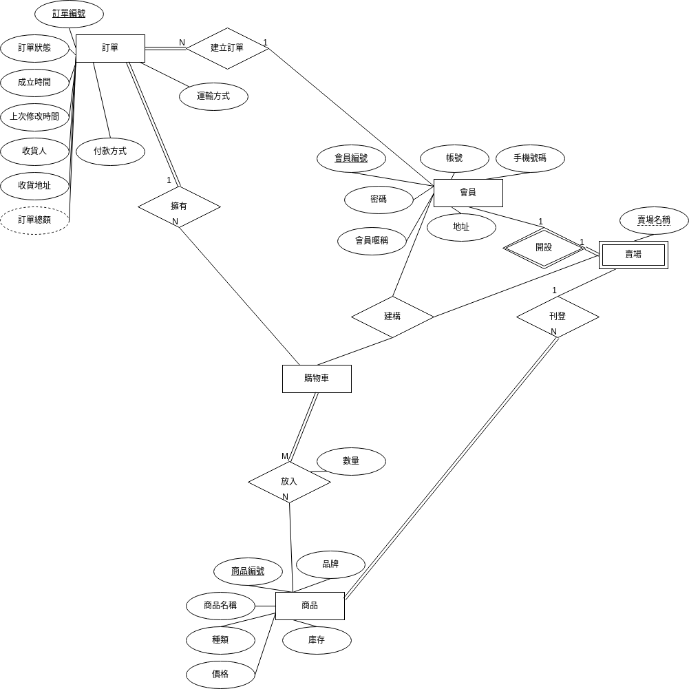
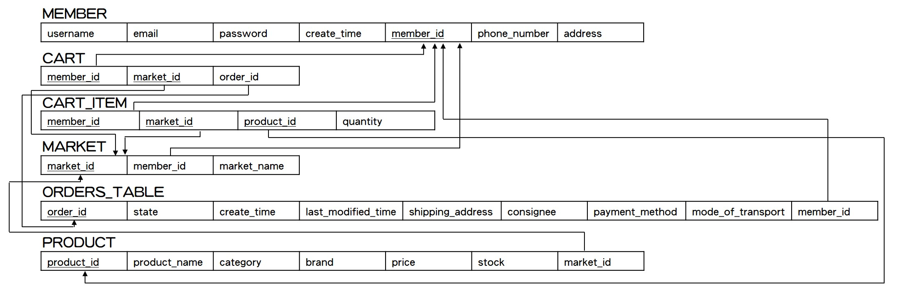

# db-e-commerce-system
db-e-commerce-system for 2023 NCCU DBMS
## Prerequisites
* python 3.8.8
* node v18.16.0
* MySQL
## MySQL
* 建立 database: ecommerce
* 在 *./flask-back-end/app.py*下修改 `'mysql+pymysql://<user>:<password>@localhost:3306/ecommerce'`
## Flask
* 進到 *./flask-back-end* 下 `cd flask-back-end` 
* 建議使用 virtualenv 建立虛擬環境
* 安裝套件 `pip install -r requirements.txt`
* 啟動 `flask run`
* http://localhost:5000/
## Vue 3
* 進到 *./vue3-front-end* 下 `cd vue3-front-end` 
* 安裝套件 `npm install`
* 啟動 `npm run dev`
* http://localhost:5137/
# Flask
## Model
* User <使用者>
* Product <商品>
* Order <訂單>
* Cart <購物車>
* Market <賣場>
## RESTful API
* /api/user/...
* /api/product/...
* /api/order/...
* /api/cart/...
* /api/market/...
# Vue 3
## Pages
* /sign-in
* /sign-up
* /profile
* /products
* /orders
* /carts
* /market
# ER-Model

# Relational Schema

